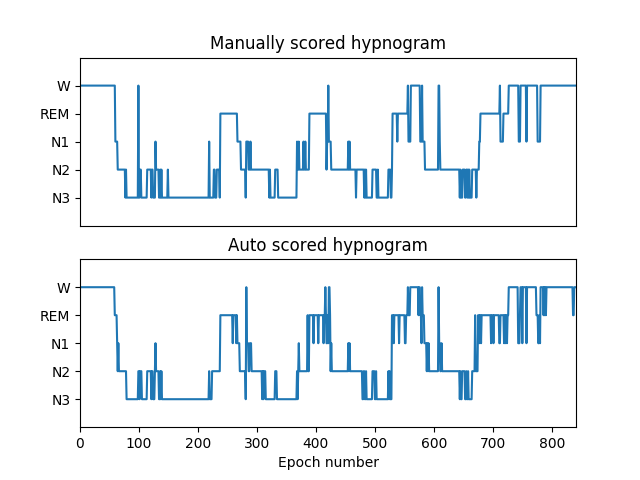
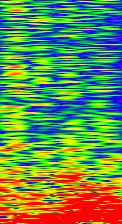
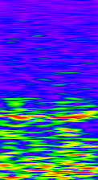
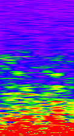
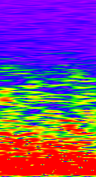
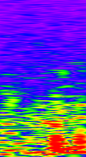
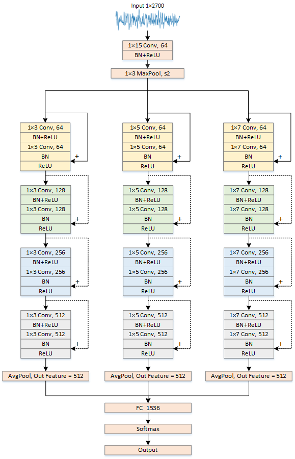

# SleepNet-A lightweight automatic sleep stages classification algorithm using single-channel EEG signals

This was originally a log repository for recording the final design whose purpose was to try out several different deep neural network structures (e.g. LSTM, ResNet, DFCNN, etc.) for automated sleep stage staging of single channel EEGs. 
 Currently, the final design has been completed and I will continue to follow this project. The focus of the project will shift to how to take the code to practical applications, and we will consider the balance between computational power and accuracy. In addition, some pre-trained models will be made available for easy use. 

 We also believe that these codes can be used for the classification of other physiological signals (e.g. ECG, EMG, etc.). We hope this will help you in your research or project.  

## How to run
If you need to run this code (train your own model or use a pre-trained model to make predictions on your own data) please go to the following page 
[How to run codes](how_to_run.md) 

## Dataset
Two publicly available sleep datasets were used for training, namely:   [[CinC Challenge 2018]](https://physionet.org/physiobank/database/challenge/2018/#files)     [[sleep-edfx]](https://www.physionet.org/physiobank/database/sleep-edfx/)  
For the CinC Challenge 2018 dataset, we only use its C4-M1 channel, and for the sleep-edfx and sleep-edf datasets, we use the Fpz-Cz channel 

Note: 
1. If you need to get pre-trained models for other EEG channels, this requires downloading these two datasets and completing the training using train.py. Of course, you can also use your own data to train the model.  
2. For the sleep-edfx dataset, we only intercepted the sleep interval between 30 minutes before going to sleep and 30 minutes after waking up as the read-in data (the experimental results are labeled with select sleep time), in order to balance the proportion of each sleep period and speed up the training.  

## A few notes
* Pre-processing 

1. Downsampling: The EEG signal of the CinC Challenge 2018 dataset will be downsampled to 100HZ  

  2. Normalization: We recommend that the EEG signals of each subject are normalized by 5th-95th quantile, i.e., the 5% largest data is 0 and the 95% largest data is 1. Note: all pre-trained models are trained according to this method after normalization  

  3. Split the read data into 30s/Epoch as one input, each input contains 3000 data points. The sleep stage labels are 5 respectively N3,N2,N1,REM,W. Each Epoch of data will correspond to a label. Label mapping: N3(S4+S3)->0 N2->1 N1->2 REM->3 W->4  

  4. Data set expansion: during training, random cuts, random flips, random changes in signal amplitude, etc. are performed on each Epoch data  

  5. For different network structures, the original eeg signal is preprocessed to have different shape- 
  LSTM: the 30s eeg signal is FIR bandpass filtered to obtain theta, σ, α, δ, β waves, and they are concatenated and used as input data 
  CNN_1d class (the network marked with 1d): no special operation, in fact, it is to replace the various models in the image field with Conv1d and then take it over to use it 
  DFCNN class (that is, the kind of idea of KDDI, first transformed into spectrogram, and then directly use various models of image classification): the 30s eeg signal is short-time Fourier transformed, and the spectrogram is generated as input, and the image classification network is used for classification. We do not recommend this method because the conversion to spectrograms requires large computing resources.  

* EEG Spectrogram 
  The spectrograms corresponding to the five sleep stages are shown here, in the following order: Wake, Stage 1, Stage 2, Stage 3, REM 
  
  
  
  
   

* multi_scale_resnet_1d network 
  
   

* About cross-validation For better practical application, we will use subject cross-validation. That is, the data in the training and validation sets come from different subjects. It is worth noting that there are two samples for each subject in the sleep-edfx dataset, and we treat both samples as the same subject, which many papers ignore, manually funny.  

* About the evaluation metrics 
  For each sleep stage label:  Accuracy = (TP+TN)/(TP+FN+TN+FP)   Recall = sensitivity = (TP)/(TP+FN) 

  For the overall: Top1 err. Kappa Also averaged for Acc and Re 

  Special note: The sample labels are distributed and unbalanced in this classification task, so our averaging is not weighted for more convincing.

## Partial experimental results
This section will be continuously updated... ... 
[[Confusion matrix]](confusion_mat) 

#### Subject Cross-Validation Results
Special Note: In this classification task, the sample label distribution and imbalance, we made a magic change to the category weights in the classification loss function, which will make the Average Recall get a small boost, but at the same time the overall error will also improve. If we use the default weights, the Top1 err. will drop at least 5%, but this will cause the recall of the N1 period, which accounts for a very small percentage of the data, to plummet by 20%, which is definitely not what we would like to see in practice. The results given below are all obtained using the magically modified weights.  
* [sleep-edfx](https://www.physionet.org/physiobank/database/sleep-edfx/)  ->sample size = 197, select sleep time

| Network                     | Parameters | Top1.err. | Avg. Acc. | Avg. Re. | Need to extract feature |
| --------------------------- | ---------- | --------- | --------- | -------- | ----------------------- |
| lstm                        | 1.25M      | 26.32%    | 89.47%    | 68.57%   | Yes                     |
| micro_multi_scale_resnet_1d | 2.11M      | 25.33%    | 89.87%    | 72.61%   | No                      |
| resnet18_1d                 | 3.85M      | 24.21%    | 90.31%    | 72.87%   | No                      |
| multi_scale_resnet_1d       | 8.42M      | 24.01%    | 90.40%    | 72.37%   | No                      |
* [CinC Challenge 2018](https://physionet.org/physiobank/database/challenge/2018/#files)  ->sample size = 994

| Network                     | Parameters | Top1.err. | Avg. Acc. | Avg. Re. | Need to extract feature |
| --------------------------- | ---------- | --------- | --------- | -------- | ----------------------- |
| lstm                        | 1.25M      | 26.85%    | 89.26%    | 71.39%   | Yes                     |
| micro_multi_scale_resnet_1d | 2.11M      | 27.01%    | 89.20%    | 73.12%   | No                      |
| resnet18_1d                 | 3.85M      | 25.84%    | 89.66%    | 73.32%   | No                      |
| multi_scale_resnet_1d       | 8.42M      | 25.27%    | 89.89%    | 73.63%   | No                      |

